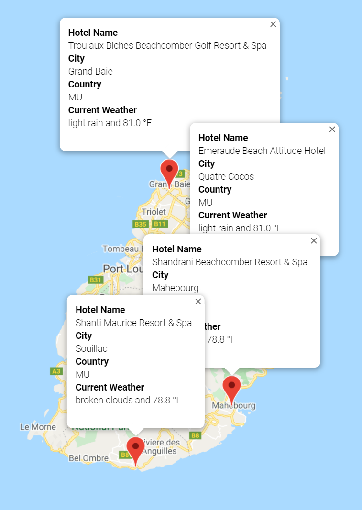

# World Weather Analysis
## Overview
For this project, we created a data frame of potential vacation destinations based on customer weather preferences. The possible destinations were generated randomly, and then we applied the open weather API to retrieve the current weather description of each location. Customers can then input the minimum and maximum temperature they desire for their trips, and the sites meeting the customer criteria are placed in a new data frame. Google's API is then used to find the nearest hotel from our randomly generated coordinates, and those hotels are then displayed in our jupyter notebooks. 

## Resources
- python 3.7.6
- jupyter notebook
- Google API
- OpenWeather API

## Results Based on Customer Search

